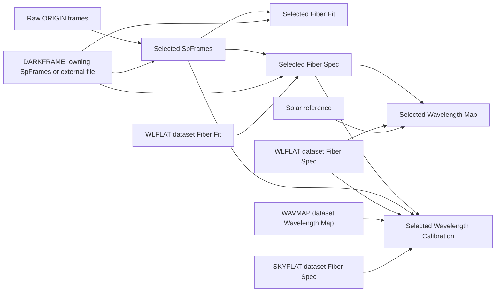

# Step 4: reduction product status and dependencies

Implemented in the verified existing C:\work\TIFRES\TIFRES.sln solution. No alternate checkout or regenerated application was used. No observation reduction was run. All 445 pre-existing files under fits/, png/, testdata/ and python/legacy/ were verified byte-for-byte unchanged, with no added files in those trees. The baseline is step4-preservation-before.json.

## Use

Select a saved dataset, then open Operations → Reduction Status → Refresh Status. The five selected-dataset stages show expected filenames, status and reasons. Expand input/calibration dependencies to see referenced files and producer DSNOs. The additional calibration section lists recursive upstream stages and any requested alternate widths. Inspection runs asynchronously in a contained Python process, never imports legacy processing code or cfg.py, and never launches reduction. It only reads files. Selecting another dataset or changing options/settings clears stale results. Every reduction attempt refreshes status after success, failure or cancellation. Run cancels an active inspection before starting; existing Run, Stop, elapsed time and recent logs remain outside the options scroller.

Status uses saved CSV data. Unsaved edits must be saved before inspection. The configured Python needs the existing numpy/astropy dependencies. Missing configuration/dependencies are reported as status-inspection errors, not hidden or interpreted as successful processing.

## Actual dependency graph

The shared contract in python/tifres_dependencies.py supplies both launcher preflight and status inspection. No DSNO is guessed from a filename suffix: calibration producers are resolved by matching the exact legacy output expression against CSV FILENAME values. Duplicate producers and references absent from the CSV remain explicitly unresolved.

Let F be the selected row's FILENAME and N be fibintwid. All suffix replacements below use the original Python string replacement semantics.

| Stage | Required inputs | Expected outputs |
| --- | --- | --- |
| SpFrames | Raw ORIGIN matches using legacy file_search regex conventions; DARKFRAME when specified | F; F with its final .fits suffix changed to .m.fits |
| Fiber Fit | F; DARKFRAME; FIBX0/FIBX1/FIBXWID/NFIBXY/IFIBIACT | F.replace('.fits', '.fib.fits') |
| Fiber Spec | F; DARKFRAME; WLFLAT.replace('.fits', '.fib.fits') from the WLFLAT dataset's Fiber Fit | F.replace('.fits', '.wNfsp.fits') |
| Wavelength Map | F.replace('.fits', '.wNfsp.fits'); WLFLAT extraction unless disabled; selected psg/psgrad{band}.txt solar reference | F.replace('.fits', '.wNwmp.fits') |
| Wavelength Calibration | F (legacy existence requirement); F extraction; WAVMAP.replace('.wmp.fits', '.wNwmp.fits'); WLFLAT extraction unless disabled; SKYFLAT extraction when supplied | F.replace('.fits', '.wNwc.fits'); F.replace('.fits', '.wNimg.fits'); SKYFLAT.replace('.fits', '.wNwc.fits') when supplied |

The .ffsp.fits and .dcb.fits paths constructed by mkWcalSpec4d are not written and are not expected products. PNGs are not reduction prerequisites and are not freshness targets. Wavelength calibration's sky-calibrated output may be shared and may coincide with the selected output; the contract deduplicates identical paths, matching the legacy behavior.

There is intentionally no unconditional Selected Fiber Fit → Selected Fiber Spec or Selected Wavelength Map → Selected Wavelength Calibration edge. Those edges exist only when the CSV references that dataset.

### The actual DSNO 260914111 references

- FILENAME: 20260914/skyA01_clf590w.sp.fits.
- WLFLAT: 20260914/wlA00_clf590w.sp.fits, owned by DSNO 260914010. Fiber extraction consumes its .fib.fits trace; wavelength stages consume its width-specific extraction.
- DARKFRAME: 20250123/dk01h_20s.sp.fits. No matching producer row was found in the current CSV; the GUI reports an external/unresolved calibration file rather than inventing a DSNO.
- WAVMAP: 20260914/skyA01_clf590w.sp.w5wmp.fits, the width-5 map produced by DSNO 260914111. Already width-qualified references remain literal, exactly as in the legacy function. A different selected fibintwid does not silently rewrite this literal reference.
- SKYFLAT: the selected FILENAME itself, DSNO 260914111. Its extracted spectrum supplies sky flat-fielding. No different calibration DSNO is assumed.

## Status and validation rules

- Missing: at least one expected output is absent. Staged/recovery files never satisfy this condition.
- Invalid: an existing output cannot be fully read or fails its structural contract. Invalid takes precedence when another output is missing.
- Outdated: bound provenance shows a relevant parameter/input/source change, or a required upstream stage is Outdated.
- Unknown: freshness cannot be proven, including historical products without matching completed provenance, unresolved/ambiguous calibration producers, inaccessible inputs, cyclic dependencies, malformed options, changed unrecorded outputs or unavailable dependencies.
- Complete: expected products pass structural validation, their identities match completed provenance, relevant options/CSV fields and input/source hashes agree, and every known upstream dependency is current.

The inspector forces HDU data reads, checks FITS structure/checksums and rejects truncation warnings. Frame/raw products require nonempty 2D arrays. Traces require (pixels, fibers, 3), matching YFIB and valid fiber-grid metadata. Spectra require the spDat/spDk extensions with matching shapes. Traces, spectra, maps and calibrated products require consistent FIBERS/IFIBERS and NFIBX/NFIBY. Calibrated spectra/images also require finite wavelength-axis metadata and a positive wavelength step; image dimensions must match the fiber grid. Modern map diagnostic extensions are not required for historical map compatibility because downstream calibration consumes the primary map and fiber layout. This is basic structural validation, not an assessment of scientific quality or fitting residuals.

Modification timestamps appear only as hints. Content hashes detect changes even when timestamps are preserved; touching identical data does not invalidate it. ORIGIN membership changes are detected. Inspection caches hashes/validation within a single scan, not across refreshes.

## Relevant parameters and provenance

Scientific option signatures are stage-specific: finterval for tracing; fibintwid for extraction; fibintwid/flgNoWLflat/fiberCoefDegree for wavelength mapping; fibintwid/flgNoWLflat for wavelength calibration. Trace geometry, wavelength line/pixel parameters, WAVSHIFT and applicable calibration selections are recorded only for stages that use them. Plot, pause, overwrite, nxFig and nyFig do not invalidate scientific products. Disabled flat-field references and unused PIXDWAVS are excluded from that stage's signature. Actual upstream stages are still checked independently.

Future successful individual reductions write provenance.json alongside recovery.json in the existing .tifres-runs/run-id directory. It records exact integer DSNO strings, relevant parameters, source SHA-256, absolute input identities/content hashes and output hashes. The launcher checks inputs/source again before publication. A record is trusted only with a Completed recovery manifest; failed/cancelled/incomplete records cannot establish freshness. FITS headers, PNGs, the existing directory layout and the CSV schema are unchanged. No provenance is retroactively added to historical products.

## Validation

- dotnet build TIFRES.sln: passed, zero warnings and errors.
- python -B -m unittest discover -s python/tests -v: 48 tests passed.
- dotnet run --project tests/Tifres.Reduction.Tests: 26 checks passed.
- dotnet run --project tests/Tifres.Gui.Tests: 114 headless checks passed.
- dotnet run --project tests/Tifres.Csv.Tests: 18 checks passed.
- git diff --check: passed.

All processing tests use temporary synthetic files or mock callables. Coverage includes all products present, missing intermediate/calibration products, content changes with preserved timestamps, finterval/fibintwid changes, WLFLAT/WAVMAP/SKYFLAT changes, shared DSNO calibrations, literal-width WAVMAP references, truncated FITS, missing HDUs/metadata, historical files, cyclic/ambiguous references, failed/cancelled records, staged-output exclusion, asynchronous GUI binding, read-only inspection, and successful future provenance recording. Existing cancellation and CSV regressions still pass.

## Limitations

- Existing successful reductions without provenance generally report Unknown, even with valid FITS files. This is intentional and does not assert that those results are scientifically invalid. An external dark frame without a CSV producer also prevents proving the entire upstream chain current.
- Content hashing and full FITS reads can take time on large archives. They run outside the GUI thread and can be cancelled by changing selection/settings or starting a reduction.
- Source identity is tracked, but library versions, hardware and complete execution environments are not certified. External writers can change files after a scan; results are a snapshot and require Refresh after outside changes.
- Recovery/provenance directories must be retained to establish freshness. Removing them does not remove published products, but returns unproven status to Unknown.
- Windows was tested. Paths and process handling retain Windows/Linux support; Linux runtime was not available for validation here.
- No Run Required Steps, automatic reprocessing, FITS viewer or scientific algorithm changes were introduced. No legacy Python file was modified in Step 4.

## Modified and added files

Modified:

- python/tifres_launcher.py
- python/tests/test_launcher.py
- src/Tifres.App/Tifres.App.csproj
- src/Tifres.App/ViewModels/OperationsViewModel.cs
- src/Tifres.App/Views/OperationsView.axaml
- tests/Tifres.Gui.Tests/GuiCancellationRegression.cs

Added:

- python/tifres_dependencies.py
- python/tifres_provenance.py
- python/tifres_status.py
- python/tests/test_status.py
- src/Tifres.App/Services/ReductionStatus.cs
- src/Tifres.App/ViewModels/OperationsStatus.cs
- docs/step4.md
- docs/step4-preservation-before.json

## Follow-up: optional wavelength-map output

A selected dataset's own wavelength map is not automatically required. If that output is absent and no CSV WAVMAP references it at the configured calibration width, the status table shows NotRequired instead of Missing. WLFLAT consumes the flat dataset's trace and extraction, not its own wavelength map. Existing optional outputs remain inspectable, and explicitly referenced missing maps still report Missing. Literal width-qualified references are respected. Invalid configuration is not hidden by the optional-stage rule. Manual execution remains available.

For DSNO 260914010, the absent wlA00_clf590w.sp.w5wmp.fits is therefore not a pipeline defect: WAVMAP points to the skyA01 map. Regression tests cover unreferenced flat maps, template/literal references that make a flat map required, genuinely missing sky maps, and invalid options.
